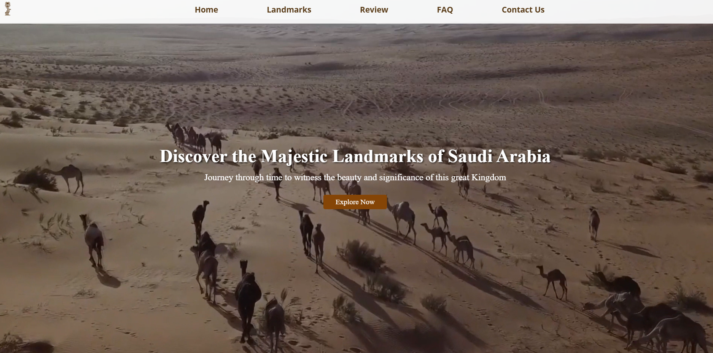

# Landmarks of Saudi Arabia

## Landing Page Idea

The **Landmarks of Saudi Arabia** website serves as a digital gateway for users to explore the rich cultural heritage and historical significance of Saudi Arabia's renowned landmarks. The landing page features an engaging hero section with a captivating video showcasing the beauty of Saudi Arabia's landscapes, enticing visitors to embark on their journey of discovery. A prominent call-to-action button encourages users to explore the various landmarks featured on the site.

## Key Features

### Hero Section

- **Captivating Headline**: "Discover the Majestic Landmarks of Saudi Arabia"
- **Descriptive Subtext**: Invites users to journey through time and witness the beauty of the Kingdom.
- **Engaging Video Background**: A scenic video of Saudi Arabia's landmarks sets an immersive atmosphere.
- **Call-to-Action Button**: "Explore Now" button directs users to the landmarks section.

### Landmarks Section

- **Informative Cards**: Each landmark is showcased in a visually appealing card format, featuring:
  - **Images**: Stunning visuals of each landmark.
  - **Titles**: Clear headings for each landmark.
  - **Descriptions**: Concise summaries highlighting the significance and appeal of each site.
- **Landmarks Featured**:
  - A'arif Fort
  - Al Malad Castle
  - Craftsmen Market in Al-Ahsa
  - Edge of the World
  - Face Rock
  - Madain Saleh
  - Jeddah Historic District
  - Pharaonic Tayma Inscription
  - The Kaaba
  - At-Turaif

### Reviews Section

- **User Testimonials**: Real feedback from visitors enhances credibility and encourages exploration.
- **Diverse Reactions**: A variety of reviews capture the emotional impact of visiting these landmarks.

### Newsletter Subscription

- **Stay Updated**: Visitors can subscribe to receive the latest news and updates about Saudi landmarks.
- **Simple Form**: A user-friendly form allows for easy email entry.

### FAQ Section

- **Frequently Asked Questions**: Addresses common inquiries to assist visitors in planning their trips.
- **Accordion Style**: Clickable questions expand to reveal answers, providing a clean and organized layout.

### Contact Information

- **Footer Section**: Includes essential contact details for inquiries.
- **Social Media Links**: Connects users to the brand's social media platforms for further engagement.

## Tools Used

- **HTML5**: Structure of the web pages, providing semantic elements for better accessibility and SEO.
- **CSS**: Styling the webpage for an attractive and responsive design.

---

For more information, visit: [Saudi Landmarks Website](https://abeeraljohanii.github.io/Saudi-Landmarks-Website/Index.html)
